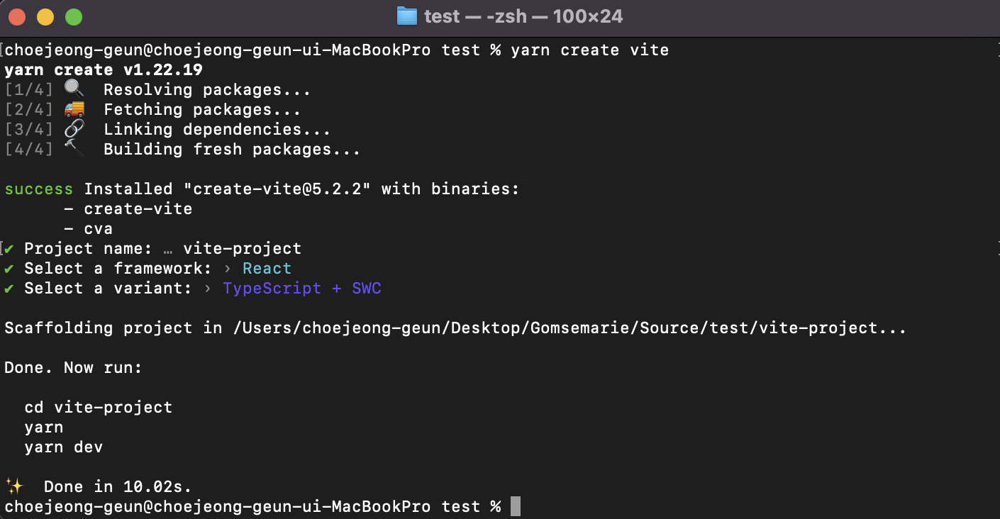
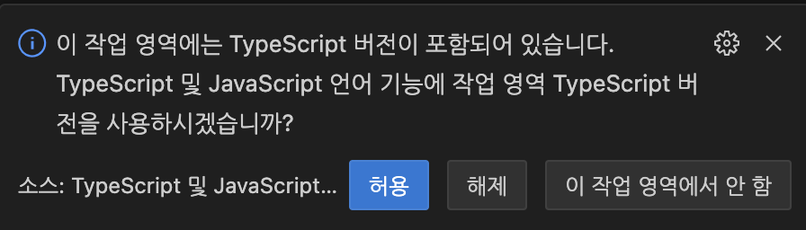

# React 환경 구성

React를 처음 시작할 때 가장 먼저 해야하는 작업! React 환경 구성을 하는 방법을 알려드립니다.

최근 React에서는 Typescript를 공식적으로 지원하는 만큼 필수적인 요소이며, 특히 다수가 동시에 개발할 때 타입 제어를 통한 안전한 개발이 가능합니다.

이 문서에서는 React + Typescript 환경으로 프로젝트를 구축하여 번들러는 Vite, 파서는 SWC를 사용합니다.

## React 프로젝트 생성하는 방법

### 1. yarn으로 프로젝트 생성

```bash
yarn create vite [프로젝트 명] --template react-ts

# Project name: 프로젝트 명
# Select a framework: React
# Select a varient : Typescript + SWC
```

<picture></picture>

### 2. Yarn berry로 변경

Yarn berry로 프로젝트를 구축하면 여러가지 이점이 있습니다.

자세한 내용이 궁금하다면 아래 링크를 참고하시면 됩니다.

[Yarn berry의 이점](https://velog.io/@oimne/yarn-berry)

```bash
yarn set version berry
yarn install
```

### 3. VSCode 에서 typescript를 `.yarn` 폴더 내에서 찾도록 변경

```bash
yarn dlx @yarnpkg/sdks vscode
# 명령어 입력 후 VSCode에서 "이 작업 영역에는 Typescript 버전이 포함..." 메세지 "허용"
```



### 4. 자주 사용되는 Dependency 추가

```bash
# 라우팅 라이브러리
yarn add react-router-dom

# 상태관리 라이브러리
yarn add recoil
```

### 5. 브라우저 마다 다르게 적용되는 CSS 초기화

```bash
yarn add sanitize.css
```

`index.css` 상단에 import 문을 추가해줍니다.

```css
@import url("sanitize.css");
@import url("sanitize.css/forms.css");
@import url("sanitize.css/typography.css");

html,
body,
:root {
  height: 100%;
}
```

## Vite를 사용하면 좋은 이유 (궁금하신분만 읽어주세요)

**개발 서버에서 처음 서버를 시작할 때 굉장히 빠릅니다.** Vite는 사전 번들링 과정에서 **Go Lang으로 작성된 Esbuild**를 사용하는데 기존에 많이 사용하고 있는 Webpack, Parcel보다 10배정도 빠른 속도를 제공합니다.

**개발 서버에서 소스코드 갱신이 빠릅니다.** 소스 코드를 업데이트 하게 되면 번들링 과정을 다시 거쳐야 하는데 vite는 HMR을 지원합니다. 이는 번들러가 아닌 ESM을 이용하는 것으로 어떤 모듈이 수정되면 vite는 그저 수정된 모듈과 관련된 부분만을 교체합니다.

**프로덕션 빌드 과정이 빠릅니다.** 프로덕션에서 번들 되지 않은 ESM을 가져오는 것은 중첩된 import로 인한 추가 네트워크 통신으로 인해 여전히 비효율적입니다. 프로덕션 환경에서 최적의 로딩 성능을 얻으려면 트리 셰이킹, 지연 로딩 및 청크 파일 분할(더 나은 캐싱을 위해)을 이용하여 번들링 하는 것이 더 좋습니다.

**Next.js에서 Vite와 SWC 공식적으로 제공할 예정입니다.** 조만간 Next.js에서 Turbopack이외에 Vite도 지원하겠다고 발표했습니다.

[Vite Document - Vite를 사용해야 하는 이유](https://ko.vitejs.dev/guide/why.html)

[Kakao FE 기술블로그 - 자바스크립트 빌드 툴](https://fe-developers.kakaoent.com/2022/220217-learn-babel-terser-swc/)
